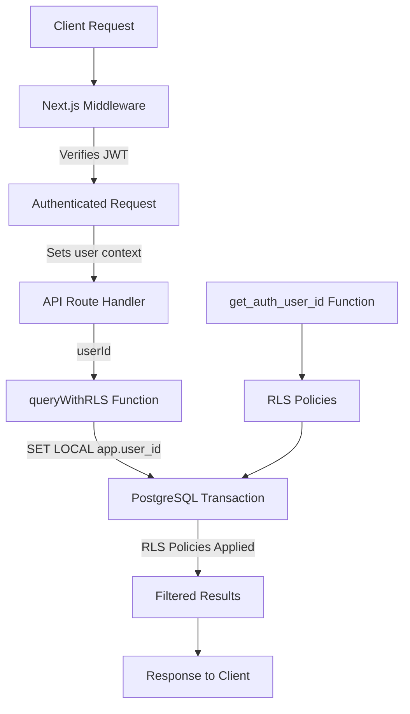

# Row-Level Security (RLS)

## Introduction

Row-Level Security (RLS) is PostgreSQL's built-in feature for implementing multi-tenancy and data isolation at the database level. RLS automatically filters database queries to ensure users can only access their own data, providing an additional security layer beyond application-level checks.

## What is Row-Level Security?

### Core Concept

RLS policies act as automatic WHERE clauses on every database query:

```sql
-- Without RLS (application must filter)
SELECT * FROM tasks WHERE userId = 'current_user';

-- With RLS (database filters automatically)
SELECT * FROM tasks; -- Only returns current user's tasks
```

**Key Benefits:**
- **Automatic Filtering**: Database enforces data isolation
- **Defense in Depth**: Security at database level, not just application
- **Developer Safety**: Impossible to accidentally expose other users' data
- **Performance**: Leverages database indexes for efficient filtering

---

## Security Architecture

### Multi-Layer Security

```text
┌─────────────────────────────────────────┐
│ Layer 4: Entity System Permissions     │
│ ├─ User flags from metadata            │
│ ├─ Plan limits                         │
│ └─ Role-based permissions              │
├─────────────────────────────────────────┤
│ Layer 3: Database RLS                  │
│ ├─ user_metas policies                 │
│ ├─ Entity-specific policies            │
│ └─ Core app policies                   │
├─────────────────────────────────────────┤
│ Layer 2: API Route Authorization       │
│ ├─ Dual authentication (session/key)   │
│ └─ Route-specific validation           │
├─────────────────────────────────────────┤
│ Layer 1: Middleware Authentication     │
│ ├─ JWT session validation              │
│ └─ User context injection              │
└─────────────────────────────────────────┘
```

### Request Flow



**Flow Explanation:**
1. Middleware validates JWT and extracts userId
2. userId passed to API route via header
3. `queryWithRLS()` sets database context
4. RLS policies filter rows automatically
5. Only authorized data returned

---

## RLS Implementation

### 1. User Context Function

The foundation of RLS is the context function that retrieves the current user:

```sql
CREATE OR REPLACE FUNCTION public.get_auth_user_id()
RETURNS TEXT AS $$
BEGIN
  RETURN current_setting('app.user_id', true);
END;
$$ LANGUAGE plpgsql SECURITY DEFINER;
```

**How it works:**
- PostgreSQL allows storing variables in transaction context
- `current_setting('app.user_id')` reads the variable set by application
- Returns the authenticated user's ID for policy evaluation

### 2. Setting User Context

Application code sets the user context in each transaction:

```typescript
// core/lib/db.ts
export async function queryWithRLS<T = any>(
  query: string,
  params: any[] = [],
  userId?: string | null
): Promise<T[]> {
  const client = await pool.connect();

  try {
    await client.query('BEGIN');

    // Set RLS context for this transaction
    if (userId) {
      await client.query(`SET LOCAL app.user_id = '${userId.replace(/'/g, "''")}'`);
    }

    // Execute query with RLS applied
    const result = await client.query(query, params);

    await client.query('COMMIT');
    return result.rows;
  } catch (error) {
    await client.query('ROLLBACK');
    throw error;
  } finally {
    client.release();
  }
}
```

**Key Points:**
- Uses `SET LOCAL` to scope variable to current transaction
- Escapes userId to prevent SQL injection
- Commits transaction to apply RLS policies
- Automatically releases connection back to pool

### 3. Enabling RLS on Tables

RLS must be explicitly enabled on each table:

```sql
-- Enable RLS (blocks all access by default)
ALTER TABLE "tasks" ENABLE ROW LEVEL SECURITY;

-- Create policies to allow specific access
CREATE POLICY "users_can_view_own_tasks" ON "tasks"
  FOR SELECT
  TO authenticated
  USING ("userId" = public.get_auth_user_id());
```

**Important:** Enabling RLS without policies blocks ALL access to the table.

---

## RLS Policy Types

### Permissive Policies (Better Auth Tables)

Better Auth tables use permissive policies because the library handles its own security:

```sql
-- User table - Better Auth manages access
CREATE POLICY "allow_all_operations_on_user" ON "user"
  FOR ALL
  USING (true)
  WITH CHECK (true);

-- Session table - Better Auth manages sessions
CREATE POLICY "allow_all_operations_on_session" ON "session"
  FOR ALL
  USING (true)
  WITH CHECK (true);

-- Account table - OAuth provider accounts
CREATE POLICY "allow_all_operations_on_account" ON "account"
  FOR ALL
  USING (true)
  WITH CHECK (true);

-- Verification table - Email verification tokens
CREATE POLICY "allow_all_operations_on_verification" ON "verification"
  FOR ALL
  USING (true)
  WITH CHECK (true);
```

**Why Permissive?**
- Better Auth operates at system level
- Library has its own authentication and authorization
- Needs unrestricted access to manage users and sessions
- Application trusts Better Auth to handle security

### Restrictive Policies (Application Tables)

Application tables use strict user-scoped policies:

#### User Metadata Table

```sql
ALTER TABLE "user_metas" ENABLE ROW LEVEL SECURITY;

-- Owner or admin can do everything
CREATE POLICY "users_metas_owner_or_admin_all" ON "user_metas"
  FOR ALL
  TO authenticated
  USING (
    "userId" = public.get_auth_user_id()
    OR EXISTS (
      SELECT 1 FROM "user"
      WHERE id = public.get_auth_user_id()
        AND role IN ('admin', 'superadmin')
    )
  )
  WITH CHECK (
    "userId" = public.get_auth_user_id()
    OR EXISTS (
      SELECT 1 FROM "user"
      WHERE id = public.get_auth_user_id()
        AND role IN ('admin', 'superadmin')
    )
  );

-- Public read for public metadata
CREATE POLICY "users_metas_public_read" ON "user_metas"
  FOR SELECT
  TO anon
  USING ("isPublic" = TRUE);
```

#### Entity Tables (Standard Pattern)

```sql
ALTER TABLE "tasks" ENABLE ROW LEVEL SECURITY;

-- Users can view their own tasks
CREATE POLICY "users_can_view_own_tasks" ON "tasks"
  FOR SELECT
  TO authenticated
  USING ("userId" = public.get_auth_user_id());

-- Users can create tasks for themselves
CREATE POLICY "users_can_create_own_tasks" ON "tasks"
  FOR INSERT
  TO authenticated
  WITH CHECK ("userId" = public.get_auth_user_id());

-- Users can update their own tasks
CREATE POLICY "users_can_update_own_tasks" ON "tasks"
  FOR UPDATE
  TO authenticated
  USING ("userId" = public.get_auth_user_id())
  WITH CHECK ("userId" = public.get_auth_user_id());

-- Users can delete their own tasks
CREATE POLICY "users_can_delete_own_tasks" ON "tasks"
  FOR DELETE
  TO authenticated
  USING ("userId" = public.get_auth_user_id());
```

---

## RLS Policy Operations

### Policy Types

**FOR SELECT** - Controls read access
```sql
CREATE POLICY "policy_name" ON "table"
  FOR SELECT
  TO authenticated
  USING (condition);
```

**FOR INSERT** - Controls create access
```sql
CREATE POLICY "policy_name" ON "table"
  FOR INSERT
  TO authenticated
  WITH CHECK (condition);
```

**FOR UPDATE** - Controls update access
```sql
CREATE POLICY "policy_name" ON "table"
  FOR UPDATE
  TO authenticated
  USING (condition)      -- Which rows can be selected for update
  WITH CHECK (condition); -- What values can be set
```

**FOR DELETE** - Controls delete access
```sql
CREATE POLICY "policy_name" ON "table"
  FOR DELETE
  TO authenticated
  USING (condition);
```

**FOR ALL** - Controls all operations
```sql
CREATE POLICY "policy_name" ON "table"
  FOR ALL
  TO authenticated
  USING (condition)
  WITH CHECK (condition);
```

### Policy Targets

**TO authenticated** - Applies to authenticated users
```sql
CREATE POLICY "policy" ON "table"
  FOR SELECT
  TO authenticated
  USING (...);
```

**TO anon** - Applies to anonymous users
```sql
CREATE POLICY "policy" ON "table"
  FOR SELECT
  TO anon
  USING (...);
```

**TO public** - Applies to all users (authenticated + anonymous)
```sql
CREATE POLICY "policy" ON "table"
  FOR SELECT
  TO public
  USING (...);
```

---

## Common RLS Patterns

### Pattern 1: Owner-Only Access

Users can only access their own records:

```sql
-- Read own records
CREATE POLICY "users_can_view_own" ON "entity"
  FOR SELECT
  TO authenticated
  USING ("userId" = public.get_auth_user_id());

-- Create records for themselves
CREATE POLICY "users_can_create_own" ON "entity"
  FOR INSERT
  TO authenticated
  WITH CHECK ("userId" = public.get_auth_user_id());

-- Update own records
CREATE POLICY "users_can_update_own" ON "entity"
  FOR UPDATE
  TO authenticated
  USING ("userId" = public.get_auth_user_id())
  WITH CHECK ("userId" = public.get_auth_user_id());

-- Delete own records
CREATE POLICY "users_can_delete_own" ON "entity"
  FOR DELETE
  TO authenticated
  USING ("userId" = public.get_auth_user_id());
```

### Pattern 2: Owner or Admin Access

Owner can access their records, admin can access all:

```sql
CREATE POLICY "owner_or_admin_access" ON "tasks"
  FOR ALL
  TO authenticated
  USING (
    "userId" = public.get_auth_user_id()
    OR EXISTS (
      SELECT 1 FROM "user"
      WHERE id = public.get_auth_user_id()
        AND role IN ('admin', 'superadmin')
    )
  )
  WITH CHECK (
    "userId" = public.get_auth_user_id()
    OR EXISTS (
      SELECT 1 FROM "user"
      WHERE id = public.get_auth_user_id()
        AND role IN ('admin', 'superadmin')
    )
  );
```

### Pattern 3: Public Read, Owner Write

Anyone can read, only owner can modify:

```sql
-- Public read
CREATE POLICY "public_read" ON "blog_posts"
  FOR SELECT
  TO public
  USING ("published" = true);

-- Owner write
CREATE POLICY "owner_write" ON "blog_posts"
  FOR ALL
  TO authenticated
  USING ("userId" = public.get_auth_user_id())
  WITH CHECK ("userId" = public.get_auth_user_id());
```

### Pattern 4: Shared Resources

All authenticated users can access:

```sql
CREATE POLICY "shared_read" ON "shared_resources"
  FOR SELECT
  TO authenticated
  USING (true);

-- But only owner can modify
CREATE POLICY "owner_modify" ON "shared_resources"
  FOR ALL
  TO authenticated
  USING ("userId" = public.get_auth_user_id())
  WITH CHECK ("userId" = public.get_auth_user_id());
```

### Pattern 5: Team-Based Access

Users can access records for their team:

```sql
CREATE POLICY "team_access" ON "projects"
  FOR ALL
  TO authenticated
  USING (
    "teamId" IN (
      SELECT "teamId" FROM "team_members"
      WHERE "userId" = public.get_auth_user_id()
    )
  );
```

---

## Using RLS in Application Code

### Query Functions

**For Better Auth Tables (No RLS):**
```typescript
import { query, queryOne, queryRows } from '@/core/lib/db'

// Direct queries (Better Auth tables)
const user = await queryOne(
  'SELECT * FROM "user" WHERE id = $1',
  [userId]
)

const sessions = await queryRows(
  'SELECT * FROM "session" WHERE "userId" = $1',
  [userId]
)
```

**For Application Tables (With RLS):**
```typescript
import { queryWithRLS, queryOneWithRLS, mutateWithRLS } from '@/core/lib/db'

// Query with RLS context
const tasks = await queryWithRLS(
  'SELECT * FROM tasks WHERE status = $1 ORDER BY "createdAt" DESC',
  ['in_progress'],
  userId // Sets RLS context
)

// Get single record with RLS
const task = await queryOneWithRLS(
  'SELECT * FROM tasks WHERE id = $1',
  [taskId],
  userId
)

// Mutation with RLS
await mutateWithRLS(
  'INSERT INTO tasks (title, "userId") VALUES ($1, $2)',
  ['New task', userId],
  userId
)
```

### API Route Example

```typescript
// app/api/v1/tasks/route.ts
import { NextRequest, NextResponse } from 'next/server'
import { queryWithRLS, mutateWithRLS } from '@/core/lib/db'
import { authenticateRequest } from '@/core/lib/api/auth/dual-auth'

export async function GET(request: NextRequest) {
  // Authenticate request
  const authResult = await authenticateRequest(request)
  if (!authResult.authenticated) {
    return NextResponse.json({ error: 'Unauthorized' }, { status: 401 })
  }

  // Query with RLS - automatically filtered by userId
  const tasks = await queryWithRLS(
    'SELECT * FROM tasks ORDER BY "createdAt" DESC',
    [],
    authResult.user.id
  )

  return NextResponse.json({ success: true, data: tasks })
}

export async function POST(request: NextRequest) {
  const authResult = await authenticateRequest(request)
  if (!authResult.authenticated) {
    return NextResponse.json({ error: 'Unauthorized' }, { status: 401 })
  }

  const { title, description } = await request.json()

  // RLS verifies userId matches context
  const result = await mutateWithRLS(
    `INSERT INTO tasks (id, "userId", title, description)
     VALUES ($1, $2, $3, $4) RETURNING *`,
    [crypto.randomUUID(), authResult.user.id, title, description],
    authResult.user.id
  )

  return NextResponse.json({ success: true, data: result.rows[0] })
}
```

### Transaction with RLS

```typescript
import { getTransactionClient } from '@/core/lib/db'

export async function updateTaskWithHistory(taskId: string, updates: any, userId: string) {
  const client = await getTransactionClient(userId)

  try {
    await client.query('BEGIN')

    // Update task (RLS ensures user owns it)
    await client.query(
      'UPDATE tasks SET title = $1 WHERE id = $2',
      [updates.title, taskId]
    )

    // Create history record (same RLS context)
    await client.query(
      'INSERT INTO task_history (taskId, userId, action) VALUES ($1, $2, $3)',
      [taskId, userId, 'updated']
    )

    await client.query('COMMIT')
  } catch (error) {
    await client.query('ROLLBACK')
    throw error
  } finally {
    client.release()
  }
}
```

---

## Security Benefits

### 1. Data Isolation

**Problem:** Application code might accidentally expose other users' data.

```typescript
// ❌ Without RLS - Vulnerable
const tasks = await db.query('SELECT * FROM tasks');
// Returns ALL tasks from ALL users
```

**Solution:** RLS automatically filters by user.

```typescript
// ✅ With RLS - Secure
const tasks = await queryWithRLS('SELECT * FROM tasks', [], userId);
// Returns ONLY current user's tasks
```

### 2. Prevention of Developer Errors

**Problem:** Developer forgets to add WHERE clause.

```typescript
// ❌ Developer error - missing filter
const result = await db.query('SELECT * FROM tasks');
```

**Solution:** RLS applies filter automatically.

```typescript
// ✅ RLS applies filter even if developer forgets
const result = await queryWithRLS('SELECT * FROM tasks', [], userId);
// Database automatically adds: WHERE userId = 'current_user'
```

### 3. Defense Against SQL Injection

**Problem:** Malicious attempt to access other users' data.

```typescript
// Attacker tries: taskId = "1' OR '1'='1"
const task = await db.query('SELECT * FROM tasks WHERE id = $1', [taskId]);
```

**Solution:** RLS limits access even if injection succeeds.

```typescript
// Even if injection bypasses WHERE clause, RLS still applies
const task = await queryWithRLS(
  'SELECT * FROM tasks WHERE id = $1',
  [taskId],
  userId
);
// Database enforces: AND userId = 'current_user'
```

### 4. Audit and Compliance

**Benefits:**
- All queries automatically user-scoped
- Complete audit trail via PostgreSQL logs
- Simplified compliance (GDPR, CCPA, etc.)
- Evidence of data protection measures

### 5. Protection Against Application Bugs

**Scenario:** Application has a bug that exposes wrong data.

```typescript
// Bug in application code
const wrongUserId = 'user-123'; // Should be current user
const tasks = await queryWithRLS('SELECT * FROM tasks', [], wrongUserId);
// RLS still protects: only returns tasks for wrongUserId, not all users
```

---

## Testing RLS Policies

### Manual Testing

**1. Test as Different Users:**
```typescript
// Create test data for multiple users
const user1Tasks = await queryWithRLS(
  'SELECT * FROM tasks',
  [],
  'user-1'
);

const user2Tasks = await queryWithRLS(
  'SELECT * FROM tasks',
  [],
  'user-2'
);

// Verify isolation
assert(user1Tasks.every(t => t.userId === 'user-1'));
assert(user2Tasks.every(t => t.userId === 'user-2'));
```

**2. Test Policy Enforcement:**
```typescript
// Try to insert task for another user
const result = await mutateWithRLS(
  'INSERT INTO tasks ("userId", title) VALUES ($1, $2)',
  ['other-user', 'Malicious task'],
  'current-user' // RLS context
);
// Should fail or return 0 rows affected
```

**3. Test Admin Override:**
```typescript
// Test admin can access all records
const adminUserId = 'admin-user-id';
const allTasks = await queryWithRLS(
  'SELECT * FROM tasks',
  [],
  adminUserId
);
// Should return tasks from all users if policy allows
```

### Automated Tests

```typescript
// test/integration/rls.test.ts
import { queryWithRLS, mutateWithRLS } from '@/core/lib/db';

describe('RLS Policies', () => {
  it('isolates user data', async () => {
    const user1 = 'user-1';
    const user2 = 'user-2';

    // Create task for user1
    await mutateWithRLS(
      'INSERT INTO tasks (id, "userId", title) VALUES ($1, $2, $3)',
      ['task-1', user1, 'User 1 Task'],
      user1
    );

    // User 2 should not see user 1's tasks
    const user2Tasks = await queryWithRLS(
      'SELECT * FROM tasks',
      [],
      user2
    );

    expect(user2Tasks).not.toContainEqual(
      expect.objectContaining({ id: 'task-1' })
    );
  });

  it('prevents unauthorized updates', async () => {
    // Try to update another user's task
    const result = await mutateWithRLS(
      'UPDATE tasks SET title = $1 WHERE id = $2',
      ['Hacked', 'other-user-task'],
      'current-user'
    );

    expect(result.rowCount).toBe(0);
  });
});
```

### Database-Level Testing

```sql
-- Test RLS policies directly in database

-- Set user context
SET LOCAL app.user_id = 'user-123';

-- Query should only return user's data
SELECT * FROM tasks;
-- Verify results are filtered

-- Try to access another user's data
SELECT * FROM tasks WHERE "userId" = 'other-user';
-- Should return empty set

-- Reset context
RESET app.user_id;
```

---

## Troubleshooting

### No Rows Returned

**Problem:** Query returns empty set unexpectedly.

**Possible Causes:**
1. RLS context not set correctly
2. User doesn't own any records
3. Policy too restrictive

**Solution:**
```typescript
// Check if userId is set
console.log('Query userId:', userId);

// Verify user owns records
const allRecords = await query('SELECT * FROM tasks WHERE "userId" = $1', [userId]);
console.log('User owns records:', allRecords.length);

// Check RLS is setting context
// In database: SELECT current_setting('app.user_id', true);
```

### RLS Not Filtering

**Problem:** User sees other users' data.

**Possible Causes:**
1. RLS not enabled on table
2. Permissive policy exists
3. Using direct query instead of queryWithRLS

**Solution:**
```sql
-- Verify RLS is enabled
SELECT tablename, rowsecurity
FROM pg_tables
WHERE schemaname = 'public' AND tablename = 'tasks';
-- rowsecurity should be true

-- Check policies
SELECT policyname, cmd, qual
FROM pg_policies
WHERE schemaname = 'public' AND tablename = 'tasks';
```

### Performance Issues

**Problem:** Queries slow with RLS.

**Solution:**
1. Add index on `userId` column
2. Optimize policy conditions
3. Use materialized views for complex policies

```sql
-- Add index for RLS filtering
CREATE INDEX idx_tasks_user_id ON tasks("userId");

-- Analyze query performance
EXPLAIN ANALYZE SELECT * FROM tasks;
```

---

## Best Practices

### Do's ✅

**1. Always Enable RLS on Application Tables**
```sql
ALTER TABLE "entity" ENABLE ROW LEVEL SECURITY;
```

**2. Use queryWithRLS for Application Data**
```typescript
// ✅ CORRECT
const data = await queryWithRLS(query, params, userId);
```

**3. Create Comprehensive Policies**
```sql
-- Cover all operations (SELECT, INSERT, UPDATE, DELETE)
CREATE POLICY "users_can_view" ON "entity" FOR SELECT ...;
CREATE POLICY "users_can_create" ON "entity" FOR INSERT ...;
CREATE POLICY "users_can_update" ON "entity" FOR UPDATE ...;
CREATE POLICY "users_can_delete" ON "entity" FOR DELETE ...;
```

**4. Test Policies Thoroughly**
```typescript
// Test as different users
// Test edge cases
// Test admin access
```

**5. Index RLS Columns**
```sql
CREATE INDEX idx_entity_user_id ON "entity"("userId");
```

### Don'ts ❌

**1. Never Bypass RLS in Application**
```typescript
// ❌ BAD - Bypasses RLS
const data = await query('SELECT * FROM tasks');

// ✅ GOOD - Uses RLS
const data = await queryWithRLS('SELECT * FROM tasks', [], userId);
```

**2. Never Disable RLS in Production**
```sql
-- ❌ BAD - Disables protection
ALTER TABLE "tasks" DISABLE ROW LEVEL SECURITY;
```

**3. Never Use Overly Permissive Policies**
```sql
-- ❌ BAD - Allows everything
CREATE POLICY "allow_all" ON "tasks"
  FOR ALL USING (true);
```

**4. Never Hardcode User IDs in Policies**
```sql
-- ❌ BAD - Hardcoded user
USING ("userId" = 'user-123')

-- ✅ GOOD - Dynamic user
USING ("userId" = public.get_auth_user_id())
```

---

## Summary

**Key Concepts:**
- RLS provides database-level data isolation
- Policies automatically filter queries
- Multi-layer security (middleware + API + RLS)
- Protection against developer errors

**Policy Types:**
- Permissive (Better Auth tables)
- Restrictive (Application tables)
- Role-based (Admin access)
- Public/Private hybrid

**Implementation:**
- Enable RLS on tables
- Create policies for each operation
- Set user context in transactions
- Use queryWithRLS in application code

**Benefits:**
- Automatic data isolation
- Defense against bugs and attacks
- Simplified compliance
- Performance optimization

**Next:** [Query Optimization](./04-query-optimization.md)

---

**Last Updated**: 2025-01-19
**Version**: 1.0.0
**Status**: Complete
